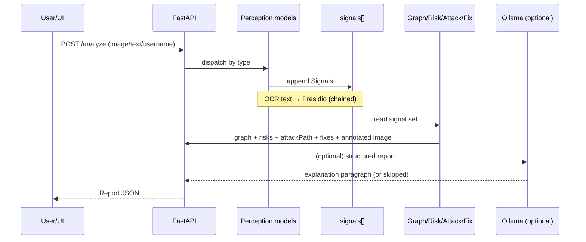

# Overshare — Full Project & Connection Map

> A **local multi-modal privacy-intelligence engine**. Drop a photo / screenshot / caption / username → it shows what a stranger could infer about you, as an **exposure graph + risk scores + attack path + fixes**.
> ARCNIGHT 2026 · **CyberTech** · 24h · local NVIDIA GPU · **pretrained models only, no external model API in the critical path.**

---

## 0. TL;DR mental model

There is **one idea that connects the whole project**: every model, no matter what it looks at, emits the same tiny object — a **Signal**. The "smart" half of the app never touches a photo or a model; it only ever reads a flat list of Signals. That decoupling is the spine:

```
RAW INPUT → [perception models] → signals[] → [graph + risk + attack + fixes] → report → UI
                                      ▲
                          the single contract everything agrees on
```

If you understand `signals[]`, you understand how every piece connects.

---

## 1. The connective tissue: the Signal contract

Every extractor (EXIF, faces, OCR, objects, PII, footprint) produces zero or more **Signal** objects and appends them to one shared list. Nothing downstream cares *which* model produced a signal — only its `type`.

```jsonc
// Signal — the universal currency of the app
{
  "type":       "gps | face | employer | location | person_name | email | phone |
                 username | home_indicator | device | timestamp | screen_text | document",
  "value":      "extracted value or label, e.g. 'Microsoft' or '12.97,77.59'",
  "source":     "exif | retinaface | paddleocr | yolo | presidio | footprint",
  "confidence": 0.0,           // 0–1
  "evidence": {                // optional, used for annotation + UI
     "bbox":  [x, y, w, h],    // present for visual detections → drives bounding boxes
     "text":  "raw OCR/NER span",
     "raw":   "anything for debugging"
  }
}
```

**Why this is the keystone:** the Exposure Graph, Risk Engine, Attack-Path Generator, Fix Engine, and the LLM all consume `signals[]` and nothing else. You can add/remove a model and the downstream logic is unchanged, as long as it emits the right `type`. **Freeze this schema in Hour 1** — every other component depends on it.

---

## 2. System overview

```mermaid
flowchart TD
    UI[React + Tailwind UI] -->|POST /analyze| API[FastAPI /analyze]
    API --> R{Router: classify input}

    R -->|image / screenshot| IMG[Image pipeline]
    R -->|caption / text| TXT[Text pipeline]
    R -->|username / email| FP[Footprint pipeline]

    subgraph PERCEPTION [Perception layer — pretrained models on GPU]
      IMG --> EXIF[EXIF parser]
      IMG --> YOLO[YOLOv8 objects]
      IMG --> FACE[RetinaFace]
      IMG --> OCR[PaddleOCR]
      OCR -->|extracted text| NER1[Presidio + spaCy]
      TXT --> NER2[Presidio + spaCy]
      FP --> CHK[requests existence checks]
    end

    EXIF & YOLO & FACE & NER1 & NER2 & CHK --> SIG[(signals[])]

    SIG --> ANN[Annotator → boxes on image]
    SIG --> GRAPH[Exposure Graph builder]
    SIG --> RISK[Risk Engine - rules]
    SIG --> ATK[Attack-Path Generator - templates]
    SIG --> FIX[Fix Engine]

    GRAPH & RISK & ATK & FIX & ANN --> REP[Report JSON]
    REP -.optional.-> LLM[Ollama LLM — phrasing only]
    LLM -.adds explanation.-> REP
    REP -->|JSON| UI
```

---

## 3. End-to-end request lifecycle (the exact order things fire)

1. **User** drags a file or pastes text/username in the UI and hits Analyze.
2. **Frontend** sends `POST /analyze` (multipart for files, JSON for text/username).
3. **Router** inspects the payload and picks a pipeline (image / text / username). A single request may carry several inputs (photo *and* caption *and* handle) → all relevant pipelines run.
4. **Perception layer** runs the right models:
   - image → EXIF + YOLO + RetinaFace + OCR run (ideally concurrently); **OCR output is then fed into Presidio** (chained dependency).
   - text → Presidio.
   - username → existence checks.
5. Every model **appends Signals** to the shared `signals[]`.
6. **Annotator** reads signals that carry a `bbox` and draws labelled boxes on a copy of the image → produces the annotated image (base64).
7. **Exposure Graph builder** turns signal `type`s into graph nodes/edges centred on a `User` node.
8. **Risk Engine** runs deterministic rules over the *set* of signal types → category scores.
9. **Attack-Path Generator** matches the signal-set against templates → ordered narrative steps.
10. **Fix Engine** maps each risky signal to a concrete remediation (some one-click).
11. **Report** is assembled from all of the above.
12. **(Optional) LLM** receives the structured report and writes a human-readable paragraph. **If Ollama is down/slow, this step is skipped and the report ships anyway.**
13. **Frontend** renders the report into fixed sections (see §4.1).



---

## 4. Layer-by-layer — every component, its I/O, and what it connects to

### 4.1 Frontend (React + Tailwind)
- **Receives from:** `/analyze` → Report JSON.
- **Renders, in order:** Upload → **Annotated Image** → **Detected Signals** (chips) → **Exposure Graph** (react-flow) → **Risk Scores** (meters) → **Attack Path** (numbered) → **Fix Suggestions** (buttons) → optional **Explanation**.
- **Connects to:** the Report schema (§4.12) only. It is dumb — all intelligence is server-side.
- **Note:** use **react-flow / cytoscape** for the graph; do not hand-roll.

### 4.2 API / Router (FastAPI)
- **Single endpoint** `POST /analyze`. Loads all models **once at startup** onto the GPU (never per-request).
- **Connects:** UI ⇄ pipelines. Owns the Signal + Report contracts.

### 4.3 Input dispatch (per type)
| Input | Models that fire | Notes |
|---|---|---|
| Photo | EXIF, YOLO, RetinaFace, OCR→Presidio | the full pipeline |
| Screenshot | OCR→Presidio, YOLO (light) | mostly text/layout; EXIF usually absent |
| Caption/text | Presidio | pure NLP |
| Username/email | footprint checks | no models, just `requests` |

### 4.4 Perception layer (pretrained, local GPU)
| Model | Input | Emits Signal(s) | `bbox`? |
|---|---|---|---|
| **EXIF** (piexif/Pillow) | image bytes | `gps`, `device`, `timestamp` | no |
| **YOLOv8** (stock COCO) | image | `home_indicator` (bed/sofa/tv), `document`, `person`, screens | yes |
| **RetinaFace** | image | `face` (+ count) | yes |
| **PaddleOCR** (EasyOCR fallback) | image | `screen_text` (raw strings) → **handed to Presidio** | yes |
| **Presidio + spaCy** | caption text **and** OCR text | `person_name`, `location`, `employer`(ORG), `email`, `phone`, `address` | no |
| **Footprint** (`requests`) | username/email | `username` per site found | no |

> **Ethics/scope guard:** RetinaFace **detects** faces; it does **not** recognize or match them against the web. "Face matched" appears only as a *hypothetical* step in the attack narrative, never as something the tool performs.

### 4.5 The Signal contract → see §1 (this is the join point for everything below).

### 4.6 Annotator
- **Reads:** signals with `evidence.bbox`. **Writes:** annotated image (base64) into the report.
- **Connects:** perception → UI's hero visual. This is the proof-the-AI-is-real element.

### 4.7 Exposure Graph builder
- **Reads:** distinct signal `type`s. **Writes:** `{ nodes, edges }`.
- **Logic:** a central `User` node; each present signal becomes a child node (`Face Visible`, `Employer Known`, `Location Known`, `Username Known`…); edges = "is exposed via". Combination edges (e.g. GPS + home_indicator → "Home locatable") highlight fused risk.
- **Connects:** signals → react-flow on the frontend. **This is the project's named innovation.**

### 4.8 Risk Engine (deterministic rules — not AI)
- **Reads:** the set of signal types. **Writes:** `{ doxxing, stalking, phishing }` (0–100, clamped).
- **Connection matrix (signal combo → score):**

| Condition (signals present) | Doxxing | Stalking | Phishing |
|---|---|---|---|
| `gps` + `face` | — | +30 | — |
| `gps` + `face` + `home_indicator` | +40 | +20 | — |
| `employer` + (`email` \| `person_name`) | — | — | +25 |
| `location` + `username` | — | +20 | — |
| `email` \| `phone` exposed | +10 | — | +20 |
| `face` + `username` | +15 | — | — |

- Deterministic = **demo-safe** (same input → same score, every time) and **explainable** ("82 because gps+face+home").

### 4.9 Attack-Path Generator (templates)
- **Reads:** signal set. **Writes:** ordered `string[]`.
- **Trigger table (signal set → template):**

| Signals present | Generated path (abridged) |
|---|---|
| `face` + `employer` + `username` | 1. Employer identified → 2. employee profiles searched → 3. face cross-referenced → 4. other accounts found → 5. targeted phishing possible |
| `gps` + `home_indicator` + `face` | 1. Home location pinned from GPS → 2. confirmed as residence → 3. occupant identifiable on sight |
| `location`(caption) + `timestamp` | 1. Routine inferred → 2. predictable presence at a place/time |

- Templates guarantee a coherent narrative **every time**, no model required.

### 4.10 Fix Engine
- **Reads:** risky signals. **Writes:** `fixes[]`, some `oneClick`.
- **Mapping:**

| Risky signal | Fix | One-click? |
|---|---|---|
| `gps` | Strip EXIF GPS → re-download clean image | ✅ |
| `face` | Blur faces / avoid identifiable shots | (manual) |
| `employer` (badge OCR) | Crop the lanyard/badge before posting | (manual) |
| `location` (caption) | Remove the place name | (manual) |
| `email`/`phone` | Redact contact info | (manual) |
| `username` footprint | Lock down / unlink exposed profiles | (manual) |

- The **one-click EXIF strip** is the satisfying demo closer.

### 4.11 Optional LLM (Ollama, local)
- **Reads:** the assembled Report (scores + evidence). **Writes:** one explanatory paragraph.
- **Connection rule:** purely additive and **non-blocking** — wrapped in try/except + timeout; failure → report ships without `explanation`. It is the *only generative* AI layer, so it's the highest-value stretch for the AI-Integration score, but never load-bearing.

### 4.12 Report assembly (the frontend contract)
```jsonc
{
  "annotatedImage": "data:image/png;base64,...",
  "signals":   [ /* Signal[] */ ],
  "graph":     { "nodes": [...], "edges": [...] },
  "risks":     { "doxxing": 87, "stalking": 75, "phishing": 62 },
  "attackPath":[ "Employer identified.", "Profiles searched.", "..." ],
  "fixes":     [ { "issue": "EXIF GPS", "action": "Strip & redownload", "oneClick": true } ],
  "explanation": "optional LLM paragraph or null",
  "meta": { "processedLocally": true, "stored": false, "modelsRun": ["exif","yolo","retinaface","ocr","presidio"] }
}
```

---

## 5. Connection summary (one glance)

```
EXIF ───► gps, device, timestamp ─────────────┐
YOLO ───► home_indicator, document, person ───┤
RetinaFace ► face ────────────────────────────┤
PaddleOCR ► screen_text ──► Presidio ──┐       ├─► signals[] ─► Graph  ─► UI
caption ──────────────────► Presidio ──┴► PII ─┤                ├─► Risk  ─► UI
footprint ► username ─────────────────────────┘                ├─► AttackPath ─► UI
                                                                ├─► Fixes ─► UI
                                                                └─► (LLM) ─► UI
```

---

## 6. Build dependency graph (what must exist before what)

```mermaid
flowchart LR
    C[Signal + Report contracts] --> EXIF
    C --> API[FastAPI /analyze skeleton]
    API --> EXIF[EXIF pipeline]
    EXIF --> PERC[YOLO + RetinaFace + OCR]
    PERC --> NER[Presidio - consumes OCR]
    NER --> FROZEN[(signals[] populated)]
    C --> FROZEN
    FROZEN --> GRAPH & RISK & ATK & FIX
    GRAPH & RISK & ATK & FIX --> REP[Report assembled]
    REP --> FE[Frontend renders]
    REP -.optional.-> LLM
    FE --> DEPLOY[Cloudflare tunnel]
```

**Critical path:** Contracts → API → EXIF (proves pipeline end-to-end with the cheapest model) → perception models → freeze `signals[]` → then Graph/Risk/Attack/Fix can be built **in parallel** → Report → Frontend → Deploy. LLM and footprint are leaf nodes that can slot in late or be cut.

**Timeline mapping:**
| Hours | Builds which nodes |
|---|---|
| 0–4 | Contracts, FastAPI skeleton, upload UI, EXIF, **download+verify all weights**, tunnel up early |
| 4–8 | YOLO + RetinaFace + Annotator (boxes) |
| 8–11 | OCR → Presidio |
| 11–14 | Exposure Graph + Risk Engine |
| 14–17 | Attack Paths + Fix Engine |
| 17–20 | Frontend (react-flow graph, meters, fix buttons) |
| 20–22 | Deploy + Cloudflare tunnel |
| 22–24 | Polish, demo, slides, LinkedIn (+10) |

---

## 7. Runtime & infra wiring

- **GPU:** all models loaded **once** at FastAPI startup; requests reuse loaded weights. Pre-download every weight in Hour 0–4 so hour-18 network flakiness can't break it.
- **Statelessness (a feature):** uploads processed **in-memory, never written to disk**, no database. `meta.stored=false` is shown in the UI — "nothing left this machine" is the privacy differentiator and the Slide 6 `DATABASE = None, by design` line.
- **No external model API** in the critical path → verifiable in the browser network tab (only the page + `/analyze` to localhost/tunnel).
- **Public demo:** Cloudflare Tunnel exposes the local box over HTTPS so judges hit it from a phone (Shippedness).
- **Reliability fallbacks:** EasyOCR ↔ PaddleOCR; canned demo username if live checks are rate-limited; LLM optional.

---

## 8. How the wiring maps to the judging rubric

| Criterion (pts) | What connects to it |
|---|---|
| Craft & Execution (25) | The whole `/analyze` pipeline working end-to-end; EXIF-first build proves it early |
| Product Thinking (20) | Sharp problem (oversharing), the Exposure Graph framing, "honest when clean" path |
| AI Integration (15) | 5 perception models doing real inference + (optional) LLM; **annotated boxes are the proof** |
| Design (15) | Fixed report sections, react-flow graph, risk meters, MICROCRAFT arcade theme |
| Shippedness (15) | Public tunnel URL, stranger-usable, in-memory, runnable repo |
| Presentation (10) | Deck in What/Who/Why/How order; live demo as the centerpiece |
| LinkedIn bonus (+10) | Post tagging MIC at hour 22–24 |

---

## 9. How it maps to the pitch deck (MICROCRAFT template)

| Slide | Fed by |
|---|---|
| PRESS START | name "Overshare", domain CyberTech |
| THE PROBLEM | §0 oversharing + a verified stat |
| OUR PLAY | the one-line + FAST/SMART/WORKS = speed / Exposure Graph / on-device |
| HOW IT WORKS | §3 chain: models → risk engine → graph → attack path + fixes |
| WHY WE WIN | §4 commodity tools (one tag, cloud) vs fusion graph + on-device |
| LOADOUT | §7 stack: React+Vite / FastAPI / None-by-design / 5 ML models / Exposure Graph |
| ROSTER | team |
| LINKS | public repo + tunnel URL |

---

## 10. Cut-lines (reliability first)

Drop in this order if time slips — none break the core: **LLM explanation → footprint live checks (keep canned) → YOLO home-indicators → screenshot path**. The irreducible spine that must ship: **EXIF + one face/OCR detection + signals[] + Exposure Graph + Risk Engine + Report + Frontend + tunnel.**
