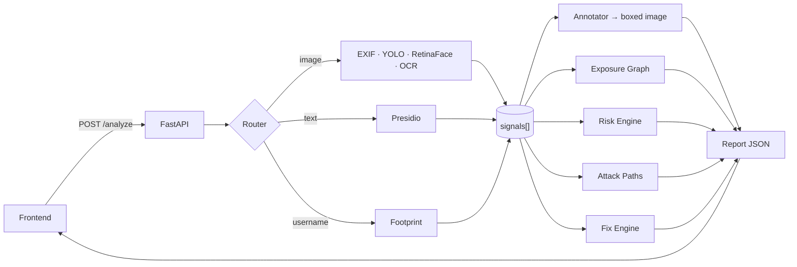

<div align="center">

# 🛰️ Overshare

**A local, multi-modal privacy-intelligence engine.**

Drop a photo, screenshot, caption, or username — and Overshare shows you exactly what
a stranger could figure out about you, as an **exposure graph + risk scores + an
attack-path narrative + one-click fixes**.

Everything runs **on-device**. Nothing is stored. No external model API is ever called.

*Built for **ARCNIGHT 2026 · CyberTech**.*

</div>

---

## The problem

People overshare without realizing how much a single post gives away. One casual
photo can leak your **home location** (EXIF GPS + a recognizable room), your
**employer and name** (a visible badge), your **contact details** (readable text in
frame), and your **other accounts** (a reused handle). Individually these look
harmless — *fused together*, they're a doxxing kit.

**Overshare fuses those weak signals the way a real stranger would**, and shows you
the damage *before* you post — then helps you undo it.

## What it does

- 📍 **Reads the metadata** — EXIF `gps` / `device` / `timestamp`.
- 🧍 **Sees the scene** — YOLOv8 finds people, home indicators (bed/sofa/tv/laptop), and documents.
- 🙂 **Detects faces** — RetinaFace boxes every face *(detection only — never recognition)*.
- 🔡 **Reads text in the image** — PaddleOCR lifts on-screen / badge / document text.
- 🕵️ **Extracts PII** — Presidio + spaCy pull names, employers, emails, phones, locations from OCR text *and* captions.
- 🔗 **Maps your footprint** — checks a username across public sites.
- 🕸️ **Builds the Exposure Graph** — a `You`-centred map of everything exposed, with **fusion edges** (GPS + bedroom → *Home locatable*).
- 📊 **Scores the risk** — deterministic Doxxing / Stalking / Phishing meters (0–100), fully explainable.
- 🎯 **Generates the attack path** — the ordered, plausible story of how a stranger chains your data.
- 🛠️ **Suggests fixes** — concrete remediations, including a **one-click EXIF-GPS strip**.
- 🖼️ **Annotates the image** — every detection drawn as a labelled box (the proof the AI is real).
- 🧠 **Explains it in plain English** — an optional local LLM (Ollama) writes the summary; if it's down, the report ships anyway.

All of it **on-device**: uploads are processed in memory, never written to disk, no
database, and **no external model API in the critical path** — verifiable in the
browser's network tab.

---

## How it works — one contract connects everything

Every model, no matter what it looks at, emits the same tiny object: a **`Signal`**.
The "smart" half of the app never touches a photo or a model — it only reads a flat
`signals[]` list. That decoupling *is* the architecture:



```
RAW INPUT → [perception models] → signals[] → [graph + risk + attack + fixes] → Report → UI
                                      ▲
                       the single contract everything agrees on
```

The `Signal` and `Report` schemas are frozen in
[`backend/contracts/`](backend/contracts/), so any model can be added or swapped
without the intelligence layer ever changing. Full design: [PLAN.md](PLAN.md).

---

## Tech stack

| Layer | Tools |
|---|---|
| **Backend** | Python · FastAPI · Pydantic v2 · Uvicorn |
| **Vision (GPU)** | PyTorch (CUDA 12.1) · Ultralytics YOLOv8 · facexlib RetinaFace · Pillow |
| **Text** | PaddleOCR (EasyOCR fallback) · Microsoft Presidio + spaCy · `requests` |
| **Intelligence** | Deterministic rules/templates (no model) — graph · risk · attack · fixes |
| **Frontend** | React · Tailwind · react-flow |
| **LLM (optional)** | Local Ollama — phrasing only, non-blocking |
| **Deploy** | Cloudflare Tunnel (public HTTPS) |

---

## Quick start

> Requires an NVIDIA GPU + recent driver, and **Python 3.11** (`py -3.11`).

### 1. Backend (vision + text stack)

```powershell
py -3.11 -m venv .venv-ml
# GPU PyTorch (CUDA 12.1) first, then everything else.
# NOTE: do NOT pin numpy<2 — opencv 4.13 requires numpy>=2.
.\.venv-ml\Scripts\python.exe -m pip install torch torchvision --index-url https://download.pytorch.org/whl/cu121
.\.venv-ml\Scripts\python.exe -m pip install -r requirements-ml.txt -r backend\requirements.txt
.\.venv-ml\Scripts\python.exe -m spacy download en_core_web_lg

# pre-pull model weights (robust retry built in), then run
.\.venv-ml\Scripts\python.exe -m scripts.download_weights
.\.venv-ml\Scripts\python.exe -m uvicorn backend.main:app --port 8077
```

> No GPU? A light **`.venv`** (`pip install -r backend\requirements.txt`) boots the
> backend in **EXIF-only** mode — the perception models simply skip, and the server
> still works ("reliability first").

### 2. Frontend

```bash
cd web
npm install
npm run dev          # opens the React UI, talking to the backend on :8077
```

### 3. Public demo (optional)

```bash
cloudflared tunnel --url http://localhost:8077
# share the printed https://<...>.trycloudflare.com URL — judges hit it from a phone
```

Then open the app, drop a photo (ideally with EXIF GPS, a face, and some text), and
watch the exposure graph, risk meters, attack path, and fixes light up.

---

## API

| Method · Path | Purpose |
|---|---|
| `POST /analyze` | Analyze a multipart image **or** JSON `{ "text": ..., "username": ... }` → a `Report`. |
| `GET /health` | `{ status, phase, device, cuda_available, models }`. |
| `GET /sample-report` | A fully-populated example `Report`. |
| `GET /` | The bundled proof UI. |

### The `Report` — the only thing the frontend consumes

```jsonc
{
  "annotatedImage": "data:image/png;base64,...",   // boxed image, or null
  "signals":   [ { "type": "gps", "value": "12.97,77.59", "source": "exif",
                   "confidence": 0.99, "evidence": { "bbox": null, "text": "...", "raw": {} } } ],
  "graph":     { "nodes": [...], "edges": [...] },   // react-flow exposure graph
  "risks":     { "doxxing": 65, "stalking": 70, "phishing": 45 },
  "attackPath":[ "Employer identified…", "Profiles searched…", "…" ],
  "fixes":     [ { "issue": "EXIF GPS", "action": "Strip & re-download", "oneClick": true } ],
  "explanation": "plain-English summary (LLM), or null",
  "meta":      { "processedLocally": true, "stored": false, "modelsRun": ["exif","yolo","retinaface","paddleocr","presidio"] }
}
```

A live example is in [`fixtures/report_sample.json`](fixtures/report_sample.json) and at `GET /sample-report`.

---

## Testing

```powershell
# Contracts + fixtures + seams (fast, no ML)
.\.venv\Scripts\python.exe    -m scripts.contract_check

# Spine: EXIF, serialization, honest-when-clean
.\.venv\Scripts\python.exe    -m scripts.smoke_test

# Vision on GPU: annotator, degradation, size-cap, concurrency, real detections
.\.venv-ml\Scripts\python.exe -m scripts.phase2_test

# Hit a running server end-to-end
.\.venv-ml\Scripts\python.exe -m scripts.live_check
```

---

## Project structure

```
backend/
  main.py                FastAPI app · POST /analyze · /health · /sample-report · model loading
  router.py              classify input → fire pipelines (EXIF/YOLO/RetinaFace/OCR→PII/footprint)
  assemble.py            signals[] → Report (calls the intelligence layer)
  annotator.py           draw labelled boxes from bbox signals → base64 PNG
  contracts/             ── FROZEN ──
    signal.py            Signal: type · value · source · confidence · evidence(bbox/text/raw)
    report.py            Report: annotatedImage · signals · graph · risks · attackPath · fixes · meta
  pipelines/
    exif.py              gps / device / timestamp
    objects.py           YOLOv8 → person / home_indicator / document
    faces.py             facexlib RetinaFace → face (detection only)
    ocr.py               PaddleOCR → screen_text
    pii.py               Presidio/spaCy → person_name / employer / email / phone / location
    footprint.py         username existence checks
    loaders.py           load OCR/PII models at startup
  intelligence/          reads signals[] only — no models
    graph.py             Exposure Graph (the named innovation)
    risk.py              Risk Engine (deterministic matrix)
    attack.py            Attack-Path Generator (templates)
    fix.py               Fix Engine
    engine.py            aggregator (the seam assemble.py calls)
web/                     React + Tailwind + react-flow frontend
fixtures/
  signals_sample.json    every SignalType, for tests/dev
  report_sample.json     a fully-populated Report
scripts/
  contract_check.py      validates contracts + fixtures + seams
  smoke_test.py          spine acceptance test
  phase2_test.py         vision acceptance test (light + GPU tiers)
  live_check.py          hit a running server
  make_test_image.py     synthetic GPS / clean JPEGs
  download_weights.py    pre-pull ML weights (robust retry)
requirements-ml.txt      the heavy ML stack
```

---

## Privacy & ethics

- **Nothing leaves the machine.** In-memory processing, no disk, no database, no
  external model API in the critical path. `meta.stored = false` is shown in the UI.
- **Faces are detected, never recognized.** RetinaFace finds faces to box them; it
  does not match anyone against the web. "Face matched" appears only as a
  *hypothetical* step in the attack narrative — never something the tool performs.
- **Defensive by design.** Overshare exists to help people reduce their *own* exposure.

---

## Documentation

- **[PLAN.md](PLAN.md)** — the full design & connection map (source of truth).
- **[PHASE_HANDOFF.md](PHASE_HANDOFF.md)** — how the perception / intelligence / frontend layers fit together.
- **[PHASE1_SUMMARY.md](PHASE1_SUMMARY.md)** · **[PHASE2_SUMMARY.md](PHASE2_SUMMARY.md)** — build notes.

<div align="center"><sub>Overshare · ARCNIGHT 2026 · runs entirely on your machine.</sub></div>
